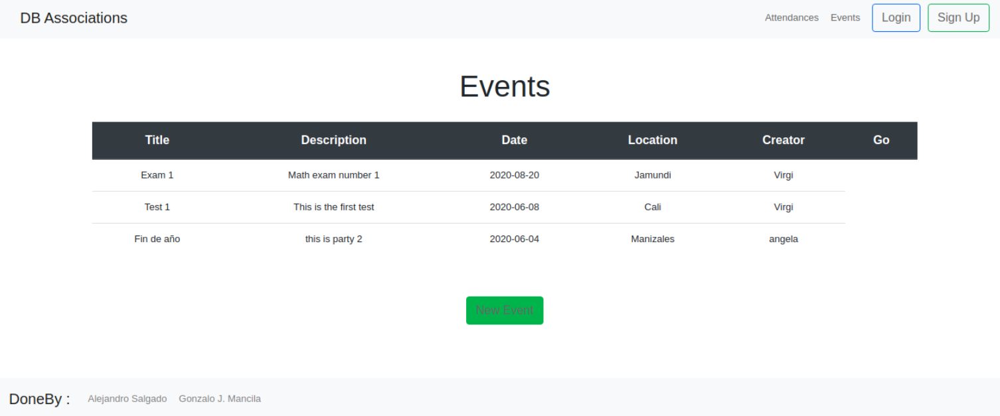

## Rails Associations :diamonds:	

This collaborative project is focused on Associations, as a part of an assignment for Microverse. The project features sessions, associations between users, events, and attendances. Users can create events and register themselves for different events created by any other user.




## Authors:
 👤 **Gonza Javier Mancilla**

- Github: [@github/gonjavi](https://github.com/gonjavi)
- Linkedin: [G-Javier-Mancilla](https://www.linkedin.com/in/g-javier-mancilla-a686a9178/)

 👤 **Daniel alejandro Salgado**

- Github: [@github/alejocode](https://github.com/AlejoCode)
- Linkedin: [@daniel-salgado](https://www.linkedin.com/in/daniel-alejandro-salgado-sanchez-13a740b1/)


## Live Demo

[Live Demo Link](https://associations-rails.herokuapp.com/)

## Built With
```bash
  Ruby 2.6.3
 ```
 ```bash
   Ruby on Rails 6.0.3.1
 ```
  ```bash
   Html5
 ```
  ```bash
   CSS3 - SCSS
 ```
  ```bash
Bootstrap
```
  ```bash
  PostgresSQL
  ```


## Installation

```bash
$ bundle install
```
* Create PostgreQSL database:
```bash
$ rails db:create
```
* Migrate the database:
```bash
$ rails db:migrate
```
* Simply run the app with :
```bash
$ rails s
```

## RSpec Tests

For RSpec testing run the following commands:

- rails db:migrate RAILS_ENV=test
- rspec --format documentation

## 🤝 Contributing

Contributions, issues and feature requests are welcome!


## Show your support

Give a ⭐️ if you like this project!
